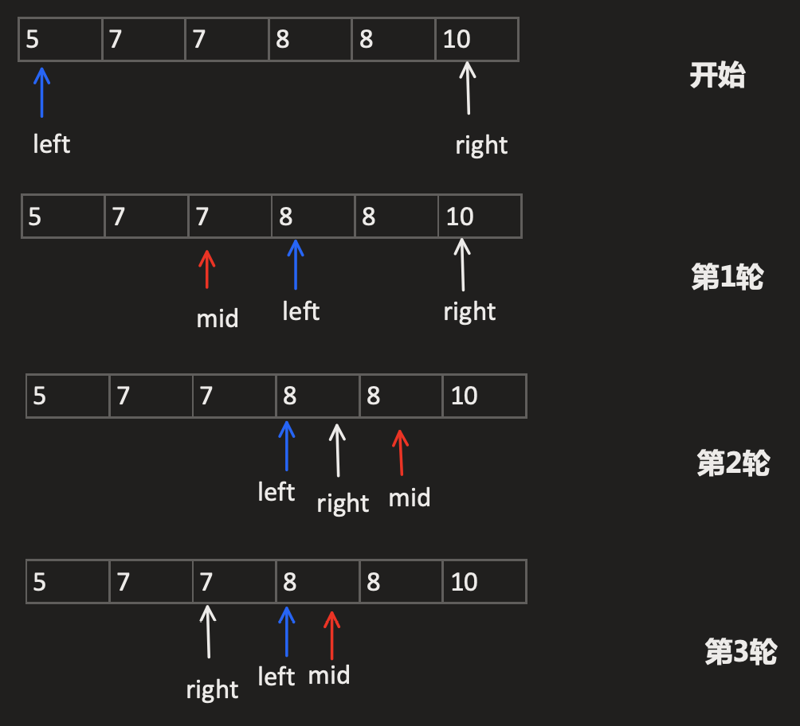
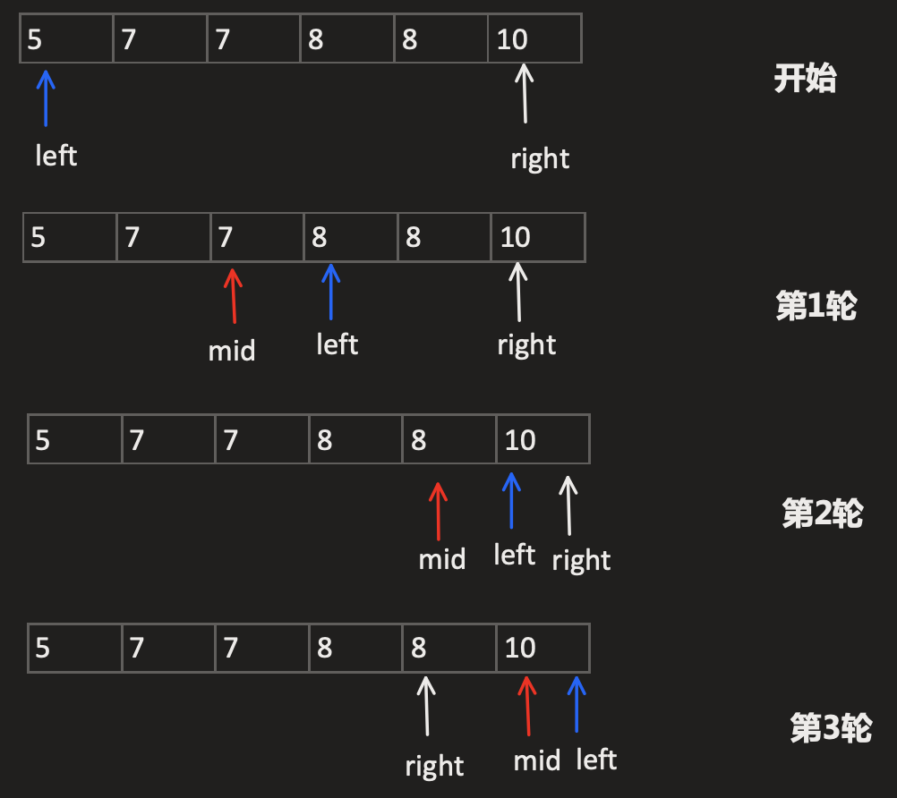

# 34. 在排序数组中查找元素的第一个和最后一个位置

## 题目
给定一个按照升序排列的整数数组 nums，和一个目标值 target。找出给定目标值在数组中的开始位置和结束位置。

你的算法时间复杂度必须是O(log n) 级别。

如果数组中不存在目标值，返回[-1, -1]。

示例 1:

```
输入: nums = [5,7,7,8,8,10], target = 8
输出: [3,4]
```

示例 2:

```
输入: nums = [5,7,7,8,8,10], target = 6
输出: [-1,-1]
```

## 思路
循环跳出条件( Left <= right )

**查找左边界(开始位置)**

- 当数组的下标对应的元素值等于目标值 target (即nums[mid] == target)时[第二轮结束]，不立即返回（数组中有多个元素的值等于目标值），而是缩小搜索区间的上界 `right` ，不断向左收缩，最后达到锁定左侧边界的目的



- 在进行第4轮循环时,不满足判断条件`left≤right`,即跳出循环
- 跳出循环后,若满足`left < nums.length && nums[left] == target`的条件即代表找到了满足条件的数组下标`left`

**查找右边界(结束位置)**



- 如上图所示,在第3轮结束后,会因为不满足`left≤right` 条件而退出循环
- 跳出循环后,若满足`right > -1 && nums[right] == target`的条件即代表找到了满足条件的数组下标`right`