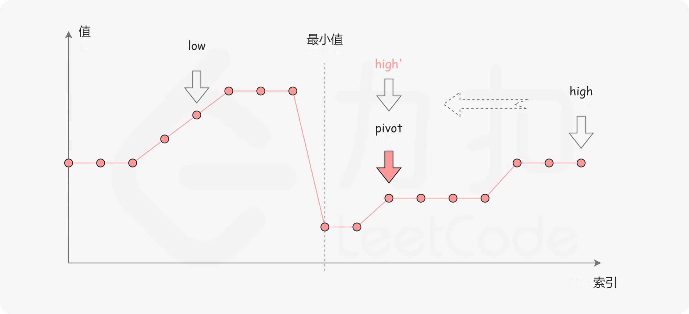
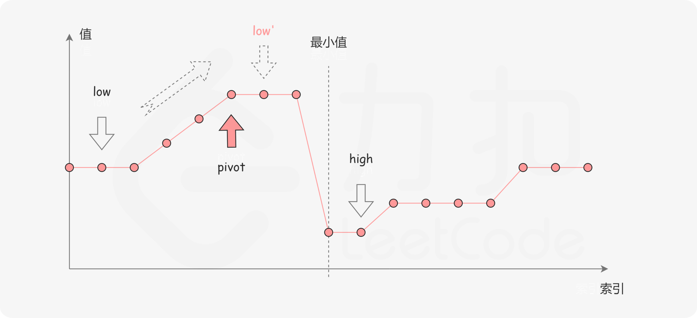
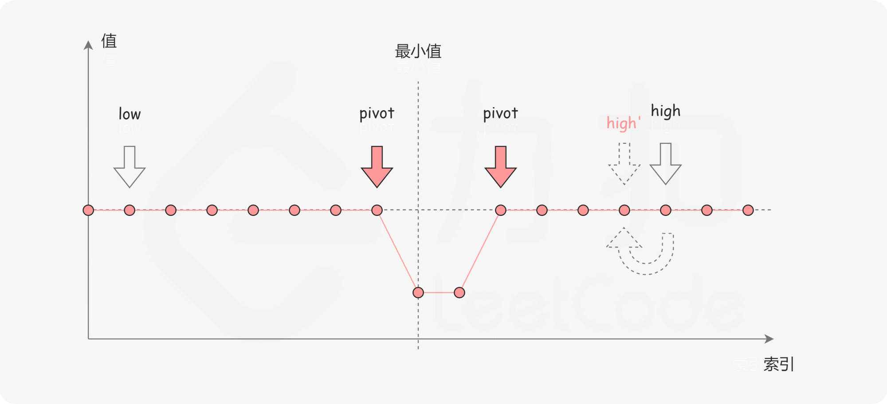

# 154. 寻找旋转排序数组中的最小值 II

## 题目
假设按照升序排序的数组在预先未知的某个点上进行了旋转。

(例如，数组[0,1,2,4,5,6,7] 可能变为[4,5,6,7,0,1,2])。

请找出其中最小的元素。

注意数组中可能存在重复的元素。

示例 1：
```
输入: [1,3,5]
输出: 1
```
示例 2：
```
输入: [2,2,2,0,1]
输出: 0
```
说明：

这道题是寻找旋转排序数组中的最小值的延伸题目。
允许重复会影响算法的时间复杂度吗？会如何影响，为什么？


## 思路
- 二分查找的每一步中，左边界为 `low`，右边界为 `high`，区间的中点为 `pivot`，最小值就在该区间内

- 中轴元素 `nums[pivot]` 与右边界元素 `nums[high]` 进行比较
    - `nums[pivot] < nums[high]`

    

    - `nums[pivot] > nums[high]`

    

    - `nums[pivot]==nums[high]`由于重复元素的存在，我们并不能确定`nums[pivot]` 究竟在最小值的左侧还是右侧。但可知无论`nums[high]` 是不是最小值，都有一个`nums[pivot]`与它相等，因此我们可以忽略二分查找区间的右端点`nums[high]`

    