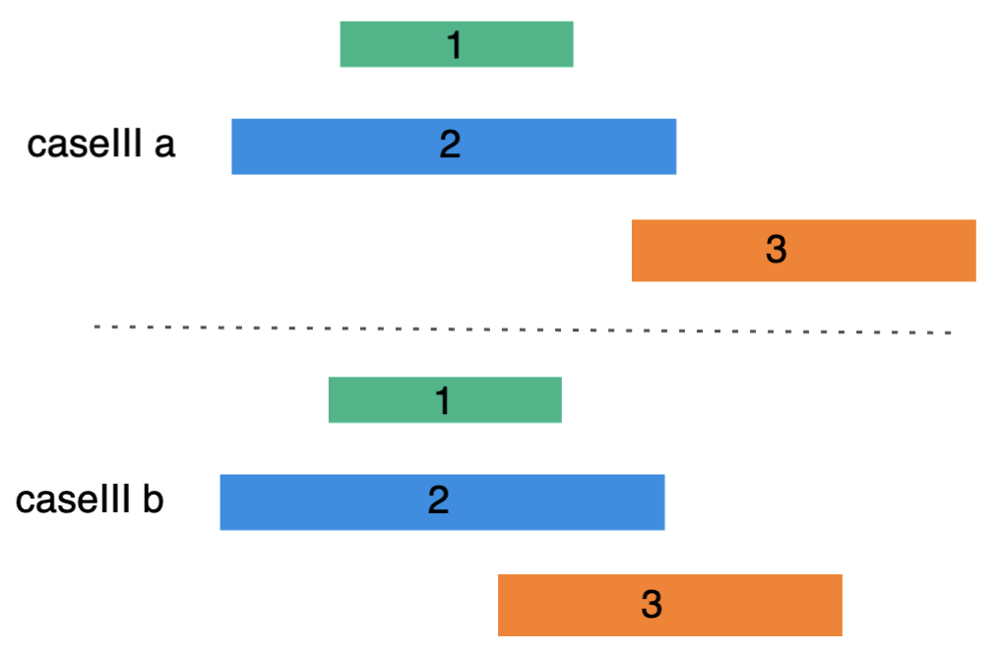

# 435. 无重叠区间

## 题目
给定一个区间的集合，找到需要移除区间的最小数量，使剩余区间互不重叠。

注意:

可以认为区间的终点总是大于它的起点。
区间 [1,2] 和 [2,3] 的边界相互“接触”，但没有相互重叠。
示例 1:
<pre>
输入: [ [1,2], [2,3], [3,4], [1,3] ]
输出: 1
解释: 移除 [1,3] 后，剩下的区间没有重叠。
</pre>
示例 2:
<pre>
输入: [ [1,2], [1,2], [1,2] ]
输出: 2
解释: 你需要移除两个 [1,2] 来使剩下的区间没有重叠。
</pre>
示例 3:
<pre>
输入: [ [1,2], [2,3] ]
输出: 0
解释: 你不需要移除任何区间，因为它们已经是无重叠的了。
</pre>

## 思路
- 这里使用贪心算法来解答这个问题
- 首先按照区间的尾进行排序
- 对排好序的区间进行遍历
    - **情况一**：两个区间之间没有任何交集

        

    - **情况二**：上一个区间是当前区间的真子集，丢弃当前区间

        

    - **情况三**：当前区间尾在上一个区间尾之后，丢弃当前区间

        

        这里直接丢弃当前空间，获得B空间。原因：下图包含了所有的情形，从图中可知，移除当前区间会获得更好的结果

        