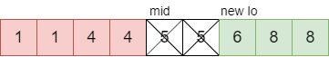
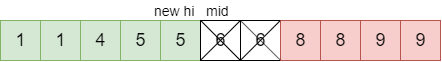
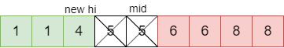
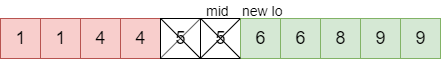

# 540. 有序数组中的单一元素

## 题目
给定一个只包含整数的有序数组，每个元素都会出现两次，唯有一个数只会出现一次，找出这个数。

示例 1:

输入: [1,1,2,3,3,4,4,8,8]
输出: 2
示例 2:

输入: [3,3,7,7,10,11,11]
输出: 10
注意: 您的方案应该在 O(log n)时间复杂度和 O(1)空间复杂度中运行。

## 思路
- 我们首先将 `left` 和 `right` 指向数组首尾两个元素。然后进行二分搜索将数组搜索空间减半，直到找到单一元素或者仅剩一个元素为止。当搜索空间只剩一个元素，则该元素就是单个元素。

- 在每个循环迭代中，我们确定 `mid`，变量 `halvesAreEven = (hi - mid) % 2 == 0`。 通过查看中间元素同一元素为哪一个（左侧子数组中的最后一个元素或右侧子数组中的第一个元素），我们可以通过变量 `halvesAreEven` 确定现在哪一侧元素个数为奇数，并更新`left` 和 `right`。
- 最难的部分是根据 `mid` 和 `halvesAreEven` 的值正确更新 `left` 和 `right`。

一共会存在4种情况

1. 中间元素的同一元素在右边，且被 mid 分成两半的数组为偶数。此时`left = mid+2`

    

2. 中间元素的同一元素在右边，且被 mid 分成两半的数组为奇数。此时`right = mid-1`

    

3. 中间元素的同一元素在左边，且被 mid 分成两半的数组为偶数。此时`right = mid-1`

    

4. 中间元素的同一元素在左边，且被 mid 分成两半的数组为奇数。此时left = mid+1

    