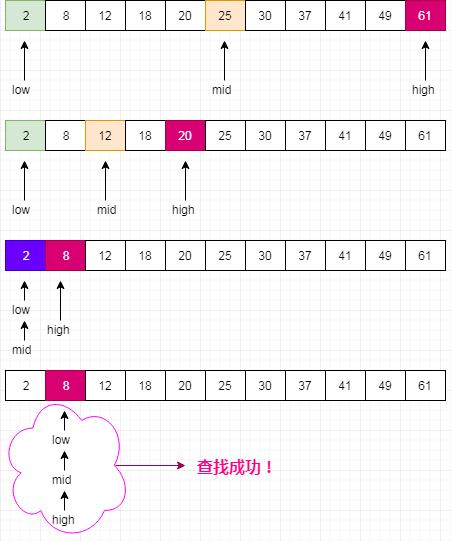

# 69. x 的平方根

## 题目 
实现int sqrt(int x)函数。

计算并返回x的平方根，其中x是非负整数。

由于返回类型是整数，结果只保留整数的部分，小数部分将被舍去。

示例 1:

```
输入: 4
输出: 2
```

示例 2:

```
输入: 8
输出: 2
说明: 8 的平方根是 2.82842..., 由于返回类型是整数，小数部分将被舍去。
```


## 思路
- 求两个边界的中间值
- 整个循环的退出条件是做边界值大于右边界值,即始终呀保持左边界值小于等于右边界值
- 求中间值的平方与x的关系
- 大于,右边界在中间值的基础上减少1后重复1~2步
- 小于等于,左边界值在中间值的基础上增加1后重复1~2步

二分查找原理图



---
有点悲伤😭，知道二分查找的原理，结果愣是没哟写出来代码。。。。啊啊啊啊啊啊