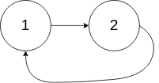

# 142. 环形链表 II

## 题目
给定一个链表，返回链表开始入环的第一个节点。如果链表无环，则返回null。

为了表示给定链表中的环，我们使用整数 pos 来表示链表尾连接到链表中的位置（索引从 0 开始）。 如果 pos 是 -1，则在该链表中没有环。注意，pos 仅仅是用于标识环的情况，并不会作为参数传递到函数中。

**说明**：不允许修改给定的链表。

进阶：

你是否可以使用 O(1) 空间解决此题？

**示例** 1：


```
输入：head = [3,2,0,-4], pos = 1
输出：返回索引为 1 的链表节点
解释：链表中有一个环，其尾部连接到第二个节点。
```

**示例** 2：



```
输入：head = [1,2], pos = 0
输出：返回索引为 0 的链表节点
解释：链表中有一个环，其尾部连接到第一个节点。
```

**示例** 3：


```
输入：head = [1], pos = -1
输出：返回 null
解释：链表中没有环。
```

**提示**：

- 链表中节点的数目范围在范围 [0, 104] 内
- -105 <= Node.val <= 105
- pos 的值为 -1 或者链表中的一个有效索引

## 思路
链表找环路的问题，有一个通用的解法——[**快慢指针**(Floyd 判圈法)](https://en.wikipedia.org/wiki/Cycle_detection)

- 给定两个指针， 分别命名为 slow 和 fast，起始位置在链表的开头
- 每次 fast 前进两步，slow 前进一步
- 如果 fast 可以走到尽头，那么说明没有环路
- 如果 fast 可以无限走下去，那么说明一定有环路，且一定存 在一个时刻 slow 和 fast 相遇
- 当 slow 和 fast 第一次相遇时，我们将 fast 重新移动到链表开头，并让 slow 和 fast 每次都前进一步
- 当 slow 和 fast 第二次相遇时，相遇的节点即为环路的开始点